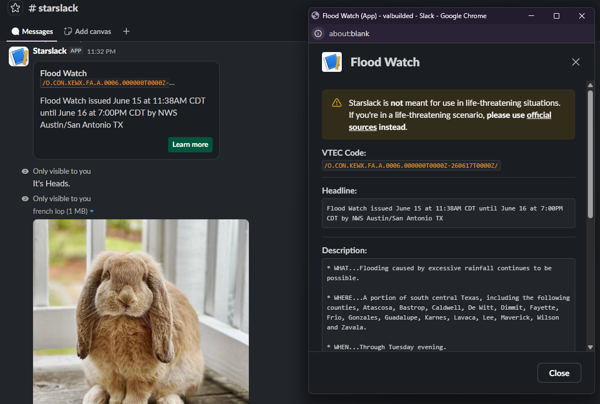

# Starslack

A simple slack bot with random NWS alerts, coin flips, and random bunnies.

[Try it on my Slack workspace!](https://join.slack.com/t/valbuilded/shared_invite/zt-40xeyg792-19fmxJ6qYzCAocwuD2oykQ)

## Self-hosting

Ensure you have the following installed:

- [Node](https://nodejs.org/en) (and npm)

And that you have a Slack workspace and app credentials for an app in said workspace. (see https://api.slack.com)

---

1. Clone the repository with `git clone https://github.com/valbuildr/starslack.git`
2. In the Slack app's dashvoard create the following slash commands: (names MUST match)
   - `/starslack-ping`
   - `/starslack-nws-alert`
   - `/starslack-coin-flip`
   - `/starslack-bunny`
3. Copy `example.env` to simply `.env` and take your Slack app's credentials (app and bot tokens) and put them in there.
4. Start the bot with `node .`

## License

This project is licensed under the GNU GPL v3 license. See [LICENSE](/LICENSE) for more info.

## AI Disclaimer

AI (Claude Sonnet 4.6) was used to interpret and help fix errors I did not understand.

## Hack Club

This project was shipped as a part of [Hack Club's Starship challenge](https://starship.hackclub.com).
